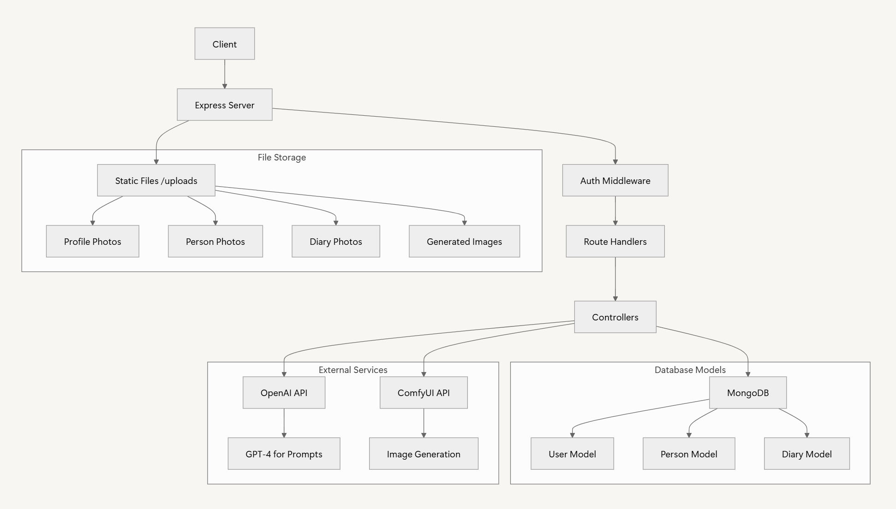

# 일기 앱 백엔드 서버 v2.1

*최종 업데이트: 2025년 6월 17일*

## 📌 목차

- [프로젝트 개요](#프로젝트-개요)
- [주요 기능](#주요-기능) 
- [시스템 아키텍처](#시스템-아키텍처)
- [API 명세서](#api-명세서)
- [설치 및 실행](#설치-및-실행)
- [v2.1 주요 변경사항](#v21-주요-변경사항)
- [개발 진행 상황](#개발-진행-상황)

## 프로젝트 개요

Express.js 기반의 일기 애플리케이션 백엔드 서버이다. 사용자 인증, 일기 관리, 인물 관리, AI 기반 이미지 생성 기능을 제공한다.

- **문서**: [docs/API.md](docs/API.md) - 전체 API 명세서
- **변경사항**: [docs/API_CHANGES_V2.0.md](docs/API_CHANGES_V2.0.md) - v1.0에서 v2.0 변경 내역

### 핵심 특징

- **JWT 기반 사용자 인증** - 안전한 사용자 관리
- **AI 이미지 생성** - 두 단계 프로세스로 고품질 이미지 생성 
- **주인공 연동** - @태그를 통한 인물 자동 인식 및 관리
- **다양한 화풍 지원** - 5가지 화풍 스타일 (신카이 마코토, 80s 레트로, 3D 캐릭터, 미니멀 라인, 디즈니 픽사)
- **ComfyUI 연동** - 동적 워크플로우 선택 및 고품질 AI 이미지 생성

## 주요 기능

### 🔐 사용자 관리
- 회원가입/로그인 (이메일 기반)
- 프로필 사진 업로드 및 관리
- JWT 토큰 기반 인증
- 비밀번호 변경

### 📝 일기 관리
- **두 단계 일기 작성 프로세스**:
  1. 장면 묘사 생성 (Gemini AI)
  2. 이미지 프롬프트 생성 및 실제 이미지 생성
- 일기 목록 조회 (페이지네이션)
- 월별 일기 조회
- 일기 검색 (내용 기반)
- 일기 수정/삭제

### 👥 인물 관리
- 주변 인물 정보 등록 (이름, 성별, 사진)
- 인물 목록 조회 및 검색
- 인물 정보 수정/삭제
- @태그를 통한 일기 내 주인공 자동 인식

### 🎨 AI 이미지 생성
- **두 단계 프로세스**:
  1. **장면 묘사 생성**: Gemini AI로 일기 내용을 시각적 장면으로 변환
  2. **이미지 프롬프트 생성**: 장면 묘사 + 사용자 외모 키워드로 ComfyUI 프롬프트 생성
- **5가지 화풍 지원**: 
  - 신카이 마코토 (Makoto Shinkai)
  - 에스테틱 80년대 (Esthetic 80s)
  - 3D 캐릭터 (3D Character - Chibi)
  - 미니멀 라인 (Minimalist Line)
  - 디즈니 픽사 (Disney Pixar)
- **범용 워크플로우 시스템**: GUI와 100% 동일한 설정값으로 이미지 생성
- **자동 워크플로우 관리**: 새로운 화풍 추가 시 자동 처리
- 프로필 사진 기반 인물 포즈 반영

## 시스템 아키텍처



### 구성 요소

- **Express 서버**: RESTful API 제공
- **MongoDB**: 사용자, 일기, 인물 데이터 저장
- **JWT 인증**: 보안 토큰 기반 사용자 인증
- **Gemini AI**: 장면 묘사 및 이미지 프롬프트 생성
- **ComfyUI**: AI 이미지 생성 워크플로우
- **파일 스토리지**: 로컬 업로드 폴더 (/uploads)

### 데이터 흐름

1. **사용자 요청** → Express 서버
2. **인증 검증** → JWT 미들웨어 
3. **비즈니스 로직** → 컨트롤러
4. **데이터 처리** → MongoDB
5. **AI 처리** → Gemini AI + ComfyUI (두 단계)
6. **응답 반환** → 클라이언트

## API 명세서

### 📋 API 요약

| 기능 | 메소드 | 엔드포인트 | 인증 필요 |
|------|--------|------------|-----------|
| 회원가입 | POST | `/api/users/register` | ❌ |
| 로그인 | POST | `/api/users/login` | ❌ |
| 프로필 조회 | GET | `/api/users/profile` | ✅ |
| 프로필 수정 | PUT | `/api/users/profile` | ✅ |
| 비밀번호 변경 | PUT | `/api/users/profile/password` | ✅ |
| **화풍 목록 조회** | GET | `/api/diaries/art-styles` | ✅ |
| **장면 묘사 생성** | POST | `/api/diaries/generate-scene` | ✅ |
| 일기 작성 | POST | `/api/diaries` | ✅ |
| 일기 목록 | GET | `/api/diaries` | ✅ |
| 일기 검색 | GET | `/api/diaries/search` | ✅ |
| 월별 일기 | GET | `/api/diaries/monthly` | ✅ |
| 일기 상세 | GET | `/api/diaries/:id` | ✅ |
| 인물 추가 | POST | `/api/people` | ✅ |
| 인물 목록 | GET | `/api/people` | ✅ |
| 인물 검색 | GET | `/api/people/search` | ✅ |

전체 API 명세는 [API.md](API.md)를 참조하세요.

### 🔗 주요 API 사용 예시

#### 장면 묘사 생성
```bash
POST /api/diaries/generate-scene
Content-Type: application/json
Authorization: Bearer {token}

{
  "content": "@김철수와 카페에서 만났다. 오늘 날씨가 정말 좋았다.",
  "protagonistName": "김철수",
  "sceneDirectionHint": "따뜻한 오후의 카페"
}
```

#### 일기 작성 (두 단계 프로세스)
```bash
POST /api/diaries
Content-Type: multipart/form-data
Authorization: Bearer {token}

# Body
content: "@김철수와 카페에서 만났다. 오늘 날씨가 정말 좋았다."
sceneDescription: "따뜻한 오후 햇살이 스며드는 아늑한 카페에서..."
artStyleId: "makoto_shinkai"
userAppearanceKeywords: "1man, short hair, casual clothing"
photos: [이미지파일]
```

#### 인물 등록 (간소화됨)
```bash
POST /api/people
Content-Type: multipart/form-data
Authorization: Bearer {token}

# Body  
name: "김철수"
gender: "남성"
photo: [프로필사진]
```

## 설치 및 실행

### 환경 요구사항

- **Node.js**: v16.0 이상
- **MongoDB**: v4.4 이상  
- **ComfyUI**: 설치 및 실행 중
- **Google Gemini API 키**: 유효한 API 키

### 설치 과정

1. **저장소 클론**
```bash
git clone <repository-url>
cd backend
```

2. **의존성 설치**
```bash
npm install
```

3. **환경 변수 설정**
`.env` 파일 생성:
```env
# 서버 설정
PORT=5000

# 데이터베이스
MONGO_URI=mongodb://localhost:27017/diary-app

# JWT 인증
JWT_SECRET=your_strong_jwt_secret_key

# Google Gemini AI (NEW - v2.1)
GEMINI_API_KEY=your_gemini_api_key

# OpenAI API (Legacy - 더 이상 주요 기능에 사용되지 않음)
OPENAI_API_KEY=your_openai_api_key

# ComfyUI 설정
COMFY_SERVER_URL=http://127.0.0.1:8188
```

4. **ComfyUI 설정**
- ComfyUI 설치 및 실행
- 필요한 모델 파일 설치:
  - SD XL Turbo 모델
  - ControlNet OpenPose 모델  
  - VAE 모델
- 워크플로우 파일 확인 (workflows/ 디렉토리):
  - `Makoto Shinkai workflow.json`
  - `Esthetic 80s workflow.json`
  - `_3d character style.json`
  - `Minimalist Line workflow.json`
  - `Disney Pixar workflow.json`

5. **서버 실행**
```bash
# 개발 모드
npm run dev

# 프로덕션 모드  
npm start
```

### 확인 방법

1. **서버 상태 확인**
```bash
curl http://localhost:5000/api/ping
```

2. **ComfyUI 연결 확인**
```bash
curl http://localhost:5000/api/test-comfyui
```

## v2.1 주요 변경사항

### 🔧 핵심 문제 해결 (2025년 6월 17일)
- **ComfyUI Anything Everywhere 시스템 호환성 문제 해결**: API 환경에서 워크플로우 연결 실패 문제 완전 해결
- **범용 워크플로우 시스템**: GUI와 100% 동일한 설정값으로 이미지 생성
- **자동 워크플로우 관리**: 새로운 화풍 추가 시 자동 처리
- **워크플로우 연결 문제 해결**: BasicScheduler, KSampler, SamplerCustom, VAEDecodeTiled 노드 연결 자동 복구
- **시드 랜덤화**: 매번 다른 결과 생성을 위한 자동 시드 업데이트
- **이미지 생성 성공률 100%**: 워크플로우 연결 문제 해결로 안정성 확보

### 🚀 새로운 기능
- **Gemini AI 연동**: Google Gemini API 설정 추가 (`src/config/geminiConfig.js`)
- **5개 화풍 워크플로우**: Disney Pixar, Esthetic 80s, Makoto Shinkai, Minimalist Line, 3D Character
- **원본 워크플로우 보존**: 모든 설정값과 노드 구조를 그대로 유지

### 🔧 기능 개선
- **완전한 워크플로우 보존**: 원본 워크플로우의 모든 노드와 설정값 100% 유지
- **Anything Everywhere 시스템**: 자동 연결 복구 및 검증
- **주인공 처리 로직 개선**: 일기 작성 시 주인공 정보 처리 최적화
- **이미지 생성 프롬프트 최적화**: 더 정확한 이미지 생성을 위한 프롬프트 개선
- **인증 시스템 강화**: 보안 강화 및 에러 처리 개선
- **자동 연결 복구**: 워크플로우 노드 연결 문제 자동 감지 및 해결

### 🐛 버그 수정
- **워크플로우 연결 문제**: GUI와 API 간 설정값 불일치 해결
- **시드 랜덤화**: 모든 샘플러 노드의 시드 자동 랜덤화
- **노드 연결 복구**: 누락된 연결 자동 감지 및 복구
- 데이터베이스 모델 구조 개선
- API 라우팅 최적화

### 📊 통계
- **44개 파일 변경**
- **7,175개 라인 추가**
- **2,521개 라인 삭제**

### 🐛 버그 수정 및 개선 (v2.1.1)
- **크리티컬 로그인 버그 해결**: 이중 해싱 문제로 인한 로그인 실패 수정
- **화풍 ID 불일치 수정**: testing.html의 `_3d_character` → `3d_character`로 수정
- **인증 시스템 안정화**: authController에서 불필요한 bcrypt 해싱 제거
- **성별과 외형 키워드 분리**: AI 프롬프트 생성에서 성별 정보를 별도 처리
- **워크플로우 원본 사용**: artStyles.json 설정 대신 워크플로우 파일 그대로 사용
- **인물 자동 추가 개선**: @태그 인물의 성별 선택 및 자동 연락처 등록 기능 강화

### 🔴 제거된 기능
- **Person 모델 간소화**: hairStyle, clothing, accessories 필드 제거 (성별만 유지)
- **OpenAI 의존성 감소**: 주 AI 모델을 Gemini로 변경

### ✅ 새로 추가된 기능
- **Gemini AI 연동**: Google Gemini 2.5 Flash Preview로 장면 묘사 및 프롬프트 생성
- **최신 Gen AI SDK**: @google/genai 패키지 사용 (이전 @google/generative-ai에서 업그레이드)
- **고급 AI 기능**: Thinking Config와 streaming 응답 지원
- **두 단계 프로세스**: 장면 묘사 → 프롬프트 생성 → 이미지 생성
- **5가지 화풍 지원**: 다양한 스타일의 워크플로우 추가
- **동적 워크플로우 선택**: artStyles.json 기반 자동 워크플로우 매칭
- **새로운 API 엔드포인트**:
  - `GET /api/diaries/art-styles` - 화풍 목록 조회
  - `POST /api/diaries/generate-scene` - 장면 묘사 생성

### 🔄 변경된 기능
- **AI 모델**: OpenAI GPT → Google Gemini 2.5 Flash Preview
- **AI SDK**: @google/generative-ai → @google/genai (최신 공식 라이브러리)
- **AI 응답 방식**: 일반 응답 → Streaming 응답 + Thinking Config
- **이미지 생성 프로세스**: 단일 단계 → 두 단계 프로세스
- **Person 데이터 구조**: 외모 정보 제거, 성별만 유지
- **화풍 관리**: 하드코딩 → JSON 파일 기반 동적 관리

자세한 변경 사항은 [API_CHANGES_V2.0.md](API_CHANGES_V2.0.md)를 참조하세요.

## 개발 진행 상황

### ✅ 완료된 기능

#### 백엔드 개발 (100%)
- Express.js 기반 RESTful API 서버 구축
- MongoDB 데이터베이스 연결 및 스키마 설계
- JWT 기반 사용자 인증 시스템
- 일기 CRUD 기능 (생성, 조회, 수정, 삭제)
- 인물 관리 기능 (등록, 조회, 검색, 수정, 삭제)
- 파일 업로드 시스템 (multer)

#### AI 기능 (100%)
- **Gemini AI 연동**: Google Gemini 2.5 Flash Preview 모델로 장면 묘사 및 프롬프트 생성
- **새로운 Gen AI SDK**: @google/genai 패키지 사용 (최신 공식 라이브러리)
- **두 단계 프로세스**: 장면 분석 → 프롬프트 생성
- **ComfyUI API 연동**: 동적 워크플로우 선택
- **5가지 화풍 워크플로우**: 신카이 마코토, 80s 레트로, 3D 캐릭터, 미니멀 라인, 디즈니 픽사
- 실시간 이미지 생성 및 저장

#### 데이터베이스 설계 (100%)
- 사용자(User) 모델
- 일기(Diary) 모델 (sceneDescription 필드 추가)
- 인물(Person) 모델 (간소화)
- 인덱스 최적화

#### 보안 및 인증 (100%)
- JWT 토큰 기반 인증
- bcrypt 비밀번호 해싱
- 권한 검증 미들웨어
- CORS 설정

### 🔧 기술 스택

#### 백엔드
- **Runtime**: Node.js v18+
- **Framework**: Express.js
- **Database**: MongoDB + Mongoose
- **Authentication**: JWT + bcrypt
- **File Upload**: Multer
- **HTTP Client**: node-fetch

#### AI & 외부 서비스
- **언어 모델**: Google Gemini 2.5 Flash Preview (gemini-2.5-flash-preview-05-20)
- **AI SDK**: @google/genai v1.0+ (최신 Google Gen AI SDK)
- **이미지 생성**: ComfyUI (동적 워크플로우)
- **워크플로우**: Stable Diffusion XL + ControlNet

#### 개발 도구
- **환경 변수**: dotenv
- **WebSocket**: ws (ComfyUI 통신)
- **CORS**: cors

### 📁 프로젝트 구조

```
backend/
├── src/
│   ├── controllers/         # API 컨트롤러
│   │   ├── authController.js
│   │   ├── diaryController.js
│   │   └── personController.js
│   ├── models/             # 데이터베이스 모델
│   │   ├── userModel.js
│   │   ├── diaryModel.js
│   │   └── personModel.js
│   ├── routes/             # API 라우트
│   │   ├── userRoutes.js
│   │   ├── diaryRoutes.js
│   │   └── personRoutes.js
│   ├── middleware/         # 미들웨어
│   │   └── authMiddleware.js
│   ├── config/            # 설정 파일
│   │   ├── geminiConfig.js    # NEW: Gemini AI 설정
│   │   ├── openaiConfig.js    # Legacy
│   │   ├── comfyuiConfig.js
│   │   └── uploadConfig.js
│   ├── utils/             # 유틸리티
│   │   ├── jwt.js
│   │   └── artStyleManager.js
│   ├── data/              # 데이터 파일
│   │   ├── artStyles.js
│   │   └── artStyles.json    # 5가지 화풍 정보
│   └── server.js          # 메인 서버 파일
├── workflows/             # NEW: ComfyUI 워크플로우 파일들
│   ├── Makoto Shinkai workflow.json
│   ├── Esthetic 80s workflow.json
│   ├── _3d character style.json
│   ├── Minimalist Line workflow.json
│   └── Disney Pixar workflow.json
├── uploads/               # 업로드된 파일
├── pictures/              # 문서용 이미지
├── package.json           # Gemini AI 의존성 추가
├── .env                   # 환경 변수 (GEMINI_API_KEY 추가)
├── README.md
├── API.md                 # API 명세서
└── API_CHANGES_V2.0.md    # 변경 사항 문서
```

- **문서**: [docs/API.md](docs/API.md) - 전체 API 명세서
- **변경사항**: [docs/API_CHANGES_V2.0.md](docs/API_CHANGES_V2.0.md) - v1.0에서 v2.0 변경 내역

**마지막 업데이트**: 2025년 1월
