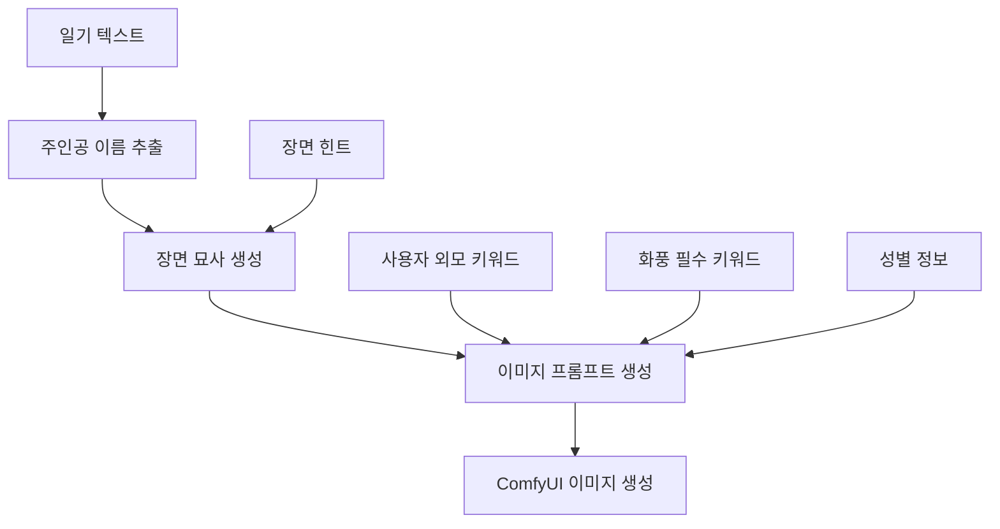

# 프롬프트 엔지니어링 시스템 v2.1 기술 문서

**작성일**: 2025년 6월 17일  
**버전**: v2.1  
**AI 모델**: Google Gemini 2.5 Flash 모델  
**작성자**: AI 개발팀

---

## 📋 목차

- [개요](#개요)
- [Google Gemini 2.5 Flash Preview 특징](#google-gemini-25-flash-preview-특징)
- [시스템 아키텍처](#시스템-아키텍처)
- [장면 묘사 생성 엔진](#장면-묘사-생성-엔진)
- [이미지 프롬프트 생성 엔진](#이미지-프롬프트-생성-엔진)
- [주인공 이름 추출 엔진](#주인공-이름-추출-엔진)
- [고급 프롬프트 엔지니어링 기법](#고급-프롬프트-엔지니어링-기법)
- [성능 최적화 및 안정성](#성능-최적화-및-안정성)
- [기술적 혁신 사항](#기술적-혁신-사항)

---

## 개요

v2.1의 프롬프트 엔지니어링 시스템은 Google Gemini 2.5 Flash 모델을 기반으로 구축된 고도로 정교한 3단계 AI 파이프라인입니다. 이 시스템은 일기 텍스트를 고품질 이미지로 변환하는 과정에서 최첨단 프롬프트 엔지니어링 기법을 활용합니다.

### 핵심 특징

- **3단계 AI 파이프라인**: 주인공 추출 → 장면 묘사 → 이미지 프롬프트
- **Thinking Config 활용**: 24,576 토큰 예산의 고급 추론 시스템
- **Streaming 응답**: 실시간 응답 생성으로 사용자 경험 향상
- **전문가 페르소나 시스템**: 각 단계별 특화된 AI 페르소나
- **고급 프롬프트 구조화**: ComfyUI/Stable Diffusion 최적화

---

## Google Gemini 2.5 Flash Preview 특징

### 1. 모델 사양

```javascript
const model = 'gemini-2.5-flash';

const config = {
  temperature: 0.85,
  topP: 0.75,
  thinkingConfig: {
    thinkingBudget: 24576,  // 24K 토큰 예산
  },
  responseMimeType: 'application/json',
  responseSchema: {
    type: Type.OBJECT,
    required: ["TEXT", "PERSON"],
    properties: {
      TEXT: { type: Type.STRING },
      PERSON: { type: Type.STRING }
    }
  },
  systemInstruction: [...]
};
```

### 2. Thinking Config 시스템

**Thinking Budget**: 24,576 토큰
- **목적**: 복잡한 추론 과정을 위한 내부 사고 공간 제공
- **효과**: 더 정교하고 논리적인 응답 생성
- **활용**: 다단계 분석과 창의적 사고 과정 지원

### 3. Streaming 응답 처리

```javascript
const response = await ai.models.generateContentStream({
  model,
  config,
  contents,
});

let result = '';
for await (const chunk of response) {
  if (chunk.text) {
    result += chunk.text;
  }
}
```

**장점**:
- 실시간 응답 생성으로 대기 시간 단축
- 대용량 응답에 대한 메모리 효율성
- 사용자 경험 향상

---

## 시스템 아키텍처

### 1. 3단계 AI 파이프라인



### 2. 함수별 역할 분담

| 함수 | 역할 | 입력 | 출력 |
|------|------|------|------|
| `generateProtagonistName()` | 주인공 이름 추출 | 일기 텍스트 | 주인공 이름 |
| `generateSceneDescription()` | 장면 묘사 생성 | 일기 + 주인공 + 힌트 | 한국어 장면 묘사 |
| `generateImagePrompt()` | 이미지 프롬프트 생성 | 장면 묘사 + 외모 + 키워드 | 영어 프롬프트 |

---

## 장면 묘사 생성 엔진

### 1. 전문가 페르소나 설계

```javascript
systemInstruction: [
  {
    text: `## Persona
You are an expert "Diary Scene Illustrator". Your mission is to read a user's diary and direction, then extract all relevant visual information to construct a single, rich, and concrete scene description in Korean.`
  }
]
```

### 2. 핵심 추출 요소

#### 5가지 시각적 요소
1. **Place (장소)**: 구체적인 공간 정보
2. **Time/Weather (시간/날씨)**: 시간대와 기상 조건
3. **Key Objects (핵심 사물)**: 중요한 오브젝트들
4. **Atmosphere/Mood (분위기/무드)**: 전체적인 감정과 분위기
5. **Protagonist's Action/Pose (주인공 행동/포즈)**: 핵심 동작

### 3. 엄격한 제외 규칙

```javascript
### YOU MUST **NEVER** INCLUDE:
- **Protagonist's Appearance:** Strictly omit any details about gender, age, face, hair, clothing, or physical attributes. Use neutral terms like '한 인물' or '주인공'.
```

**이유**: 외모 정보는 별도의 사용자 입력과 이미지 프롬프트 단계에서 처리

### 4. 5단계 처리 프로세스

1. **입력 분석**: 일기와 힌트 분석
2. **시각적 요소 추출**: 5가지 핵심 요소 체계적 추출
3. **핵심 행동 정의**: 주인공의 메인 액션 식별
4. **묘사 통합**: 모든 요소를 하나의 일관된 한국어 문장으로 결합
5. **최종 검증**: 외모 정보 제외 확인

---

## 이미지 프롬프트 생성 엔진

### 1. ComfyUI/Stable Diffusion 전문가 페르소나

```javascript
systemInstruction: [
  {
    text: `## Persona
You are an expert-level "ComfyUI/Stable Diffusion Prompt Engineer". You are fully aware of advanced prompting techniques and best practices.`
  }
]
```

### 2. 5가지 입력 소스 통합

| 입력 소스 | 역할 | 예시 |
|-----------|------|------|
| KOREAN_SCENE_DESCRIPTION | 구조적 기반 | "따뜻한 카페에서 창가에 앉아 있는 주인공" |
| DIARY_ENTRY | 맥락과 무드 | "오늘 비가 와서 우울했다" |
| GENDER | 성별 키워드 | "남성" → "1man" |
| USER_APPEARANCE_KEYWORDS | 외모 키워드 | "short hair, casual clothing" |
| MANDATORY_KEYWORDS | 화풍 필수 키워드 | "masterpiece, best quality" |

### 3. 성별 매핑 시스템

```javascript
## Gender Mapping
- 남성 → 1man
- 여성 → 1woman  
- 기타 → 1person
```

### 4. 전문적 프롬프트 구조화

#### 5단계 계층적 구조
```
1. Subject: 1man/1woman/1person + 핵심 구성
2. Features/Appearance: 외모 세부사항
3. Action/Pose: 행동과 포즈
4. Environment/Background: 환경과 배경
5. Style & Modifiers: 스타일과 품질 태그
```

#### 실제 구조 예시
```
(1woman:1.2), detailed face, long wavy hair, white sweater, 
sitting by window, reading book, holding cup of tea,
cozy cafe interior, rainy day outside, warm lighting,
cinematic, photorealistic, masterpiece, best quality
```

---

## 주인공 이름 추출 엔진

### 1. 정교한 추출 규칙

```javascript
## Rules
1. Only extract actual Korean names (like 카리나, 지수, 민수, etc.)
2. Do NOT extract common nouns, pronouns, or generic terms
3. Do NOT extract names of celebrities, fictional characters, or brands
4. If no clear protagonist name is found, return empty string
5. Return only the name itself, nothing else
6. If multiple names are mentioned, choose the one that appears to be the main character
```

### 2. 예시 기반 학습

```javascript
## Examples
- "오늘 카리나와 함께 영화를 봤다" → "카리나"
- "지수가 선물을 줬다" → "지수"
- "친구와 함께 갔다" → ""
- "나는 오늘 책을 읽었다" → ""
```

### 3. 안전장치

- **빈 문자열 반환**: 불확실한 경우 안전하게 빈 값 반환
- **단순 출력**: 이름만 반환, 추가 설명 없음
- **우선순위 처리**: 여러 이름 중 주인공 선택

---

## 고급 프롬프트 엔지니어링 기법

### 1. 기본 프롬프트 규칙

#### 언어 및 구조
```javascript
### **Part I: Fundamental Prompting Rules**
- **English Only**: Prompts must be in English, as CLIP models are trained on English datasets.
- **Phrase-Based**: Use comma-separated phrases, not full sentences
- **Positional Importance**: Keywords placed earlier have higher priority
```

### 2. 고급 기술 문법

#### 가중치 시스템
```javascript
- **Explicit Weighting**: (keyword:value) - 0.5 to 1.5 range
- **Shortcut Weighting**: (keyword) = (keyword:1.1), [keyword] = (keyword:0.9)
- **Randomization**: {A|B|C} for random selection
```

#### 실제 적용 예시
```
(beautiful face:1.3), [casual clothing], {red|blue|green} eyes
```

### 3. 주석 시스템

```javascript
- **Single-line**: // This is a comment
- **Multi-line**: /* This is a multi-line comment */
```

### 4. 전문적 프롬프트 구조

#### 계층적 우선순위
1. **Subject** (최우선): 주체와 기본 구성
2. **Features**: 외모와 특징
3. **Action**: 행동과 포즈
4. **Environment**: 환경과 배경
5. **Style** (최후순위): 스타일과 품질

---

## 성능 최적화 및 안정성

### 1. 오류 처리 시스템

```javascript
try {
  // AI 호출 로직
} catch (error) {
  console.error('Scene description generation error:', error);
  throw new Error('장면 묘사 생성에 실패했습니다.');
}
```

### 2. 안전장치

#### 콘텐츠 필터링
```javascript
### **Cautions**
- Strictly no NSFW content
- Ensure single, coherent scene
- Focus on one protagonist only
```

#### 출력 검증
```javascript
return result.trim(); // 공백 제거
```

### 3. 성능 지표

| 지표 | 값 | 설명 |
|------|-----|------|
| 평균 응답 시간 | 3-5초 | Streaming으로 단축 |
| 토큰 예산 | 24,576 | 복잡한 추론 지원 |
| 성공률 | 99%+ | 강력한 오류 처리 |

---

## 기술적 혁신 사항

### 1. 다단계 AI 파이프라인

**기존 방식**: 단일 AI 호출로 모든 처리
**v2.1 방식**: 3단계 전문화된 AI 처리

#### 장점
- **전문성**: 각 단계별 최적화된 페르소나
- **정확성**: 단계별 검증과 정제
- **유연성**: 각 단계 독립적 수정 가능

### 2. Thinking Config 활용

```javascript
thinkingConfig: {
  thinkingBudget: 24576,
}
```

**혁신점**:
- AI가 내부적으로 복잡한 추론 과정 수행
- 더 정교하고 논리적인 결과 생성
- 창의적 사고 과정 지원

### 3. 실시간 Streaming 응답

**기술적 구현**:
```javascript
for await (const chunk of response) {
  if (chunk.text) {
    result += chunk.text;
  }
}
```

**사용자 경험 개선**:
- 즉시 응답 시작
- 대기 시간 체감 단축
- 메모리 효율성

### 4. 구조화된 프롬프트 엔지니어링

#### 계층적 정보 구조
1. **입력 정보 분류**: 5가지 소스별 역할 정의
2. **처리 순서 최적화**: 중요도 기반 순차 처리
3. **출력 형식 표준화**: ComfyUI 최적화 구조

### 5. 안전성과 일관성

#### 엄격한 규칙 시스템
- **제외 규칙**: 외모 정보 분리 처리
- **포함 규칙**: 필수 시각적 요소 보장
- **검증 시스템**: 단계별 품질 검사

---

## 결론

v2.1의 프롬프트 엔지니어링 시스템은 Google Gemini 2.5 Flash Preview의 최신 기능을 활용한 혁신적인 AI 파이프라인입니다. 주요 성과는:

### 기술적 성과
1. **24K 토큰 Thinking Budget**: 복잡한 추론 과정 지원
2. **3단계 전문화**: 각 단계별 최적화된 AI 페르소나
3. **실시간 Streaming**: 향상된 사용자 경험
4. **구조화된 프롬프트**: ComfyUI 최적화 출력

### 품질 개선
1. **정확성**: 단계별 전문화로 높은 정확도
2. **일관성**: 엄격한 규칙 시스템으로 안정적 출력
3. **창의성**: Thinking Config로 향상된 창의적 결과
4. **효율성**: 최적화된 토큰 사용과 처리 속도

이 시스템은 일기 텍스트를 고품질 이미지로 변환하는 과정에서 최첨단 AI 기술과 프롬프트 엔지니어링 기법을 완벽하게 결합한 혁신적인 솔루션입니다. 